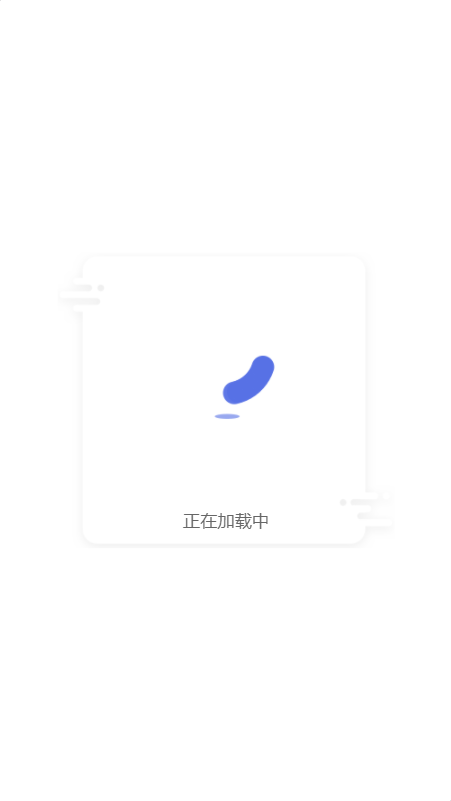

中文文档 | [英文文档](./en/README.MD)

# 基于Vue3的loading插件

>  proste： 波兰语，简单的，实在找不到什么好玩的单词了，本来想用tiga（迪迦奥特曼），但是感觉太中二了...

### 初始化插件能力

``` vue
<!-- App.vue -->

<template>
  <HelloWorld msg="Welcome to Your Vue.js App"/>
</template>

<script>
import HelloWorld from './components/HelloWorld.vue'

import {provideLoad} from 'proste-loading';
export default {
  name: 'App',
  setup(){
    // 提供loading—hook能力
    provideLoad();
  },
  components: {
    HelloWorld
  }
}
</script>

```

### 继承使用hook能力

| Param |  Type     | Description       |
| :---- | :----:    | :---------------  |
| type  | Boolean   | 是否展示            |
| msg   | String    | loading 提示语句(可选)    |
| duration   | Number    | 持续时间(可选)    |


``` vue
<!-- HelloWorld.vue  -->


<template>
  <div class="hello">
    <h1>{{ msg }}</h1>
  </div>
</template>

<script>
import {useLoad} from '../plugin/loading';

export default {
  name: 'HelloWorld',
  setup(){
    // 继承使用hook
    const loading = useLoad();
    loading(true, '加载中', 2000);
  },
  props: {
    msg: String
  }
}
</script>

```

